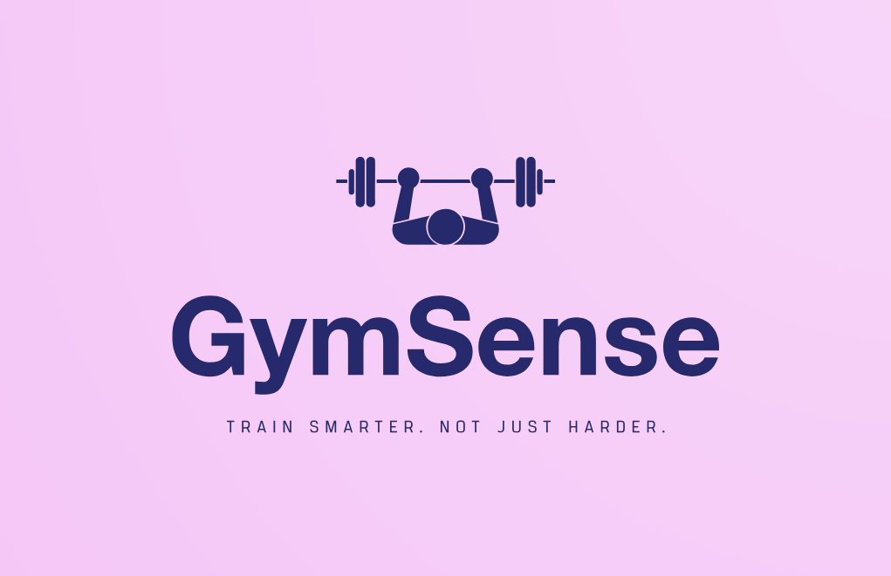

# Projektdokumentation - GymSense

  

## Inhaltsverzeichnis

1. [Ausgangslage](#1-ausgangslage)
2. [Lösungsidee](#2-lösungsidee)
3. [Vorgehen & Artefakte](#3-vorgehen--artefakte)
    1. [Understand & Define](#31-understand--define)
    2. [Sketch](#32-sketch)
    3. [Decide](#33-decide)
    4. [Prototype](#34-prototype)
    5. [Validate](#35-validate)
4. [Erweiterungen [Optional]](#4-erweiterungen-optional)
5. [Projektorganisation [Optional]](#5-projektorganisation-optional)
6. [KI-Deklaration](#6-ki-deklaration)
7. [Anhang [Optional]](#7-anhang-optional)

---

# 1. Ausgangslage

Die steigende Popularität von Fitness und Krafttraining führt dazu, dass immer mehr Personen regelmässig ins Fitnessstudio gehen. Dabei besteht jedoch häufig das Problem, dass Trainings nicht systematisch dokumentiert werden. Viele Trainings werden spontan durchgeführt, ohne klare Struktur oder Nachverfolgung des Fortschritts.

Zudem fällt es insbesondere Einsteiger:innen schwer, den Überblick über ihre Trainingsentwicklung zu behalten. Ohne eine klare Dokumentation ist es schwierig zu erkennen, ob Fortschritte erzielt werden oder ob Anpassungen notwendig sind. Ein weiteres Problem besteht darin, dass Übungen oft nicht korrekt ausgeführt werden, was das Verletzungsrisiko erhöht und die Effektivität des Trainings reduziert.

Bestehende Fitness-Apps bieten zwar zahlreiche Funktionen, sind jedoch häufig komplex, überladen oder nicht auf die tatsächlichen Bedürfnisse von Nutzer:innen zugeschnitten. Viele Anwendungen fokussieren sich stark auf zusätzliche Features wie Social Sharing oder umfangreiche Statistiken, während einfache und verständliche Workflows in den Hintergrund geraten.

Aus diesen Gründen besteht Bedarf nach einer übersichtlichen und nutzerfreundlichen Anwendung, welche das Training strukturiert erfasst, Fortschritte sichtbar macht und gleichzeitig bei der korrekten Ausführung von Übungen unterstützt.

---

# 2. Lösungsidee

Die Lösung ist **GymSense** – eine moderne Fitness-Webapplikation zur strukturierten Erfassung und Nachverfolgung von Krafttrainings.

## Kernfunktionalität

- Training erfassen mit Übungen, Sätzen, Gewicht und Wiederholungen
- Fortschritt und persönliche Rekorde verfolgen
- Trainingspläne auswählen und starten
- Übungen durchsuchen und filtern
- Lieblingsübungen speichern
- Profil mit Trainingsstatistiken und Kalender
- Benutzerkonto mit Login und Registrierung
- Responsives Design inklusive Dark Mode

## Erweiterte Funktionen

- GymSense Coach (integrierter Fitness-Assistent)
- Apple Health Prototype mit Schritttracking
- Rezeptsystem mit Fitness-Rezepten
- Smart Welcome Experience für neue Nutzer:innen
- Interaktiver Trainingskalender
- Live-Trainings-Zusammenfassung

---

# 3. Vorgehen & Artefakte

## 3.1 Understand & Define

### Zielgruppe

Die primäre Zielgruppe umfasst Personen zwischen 18 und 35 Jahren, die regelmässig Krafttraining betreiben und ihren Fortschritt digital dokumentieren möchten.

### Wichtige Erkenntnisse

- Viele Fitness-Apps sind überladen
- Fortschritt ist ein wichtiger Motivationsfaktor
- Einfache Workflows sind entscheidend
- Mobile Nutzung ist zentral
- Übungen mit Tipps und Videos helfen Einsteiger:innen

---

## 3.2 Sketch

- Erste Wireframes wurden in Figma erstellt
- Fokus lag auf schneller Bedienbarkeit
- Dashboard-Ansatz für wichtige Informationen
- Mobile-First Layouts

---

## 3.3 Decide

### Gewählte Lösung

Es wurde eine moderne Web-App mit SvelteKit gewählt.

### Gründe

- Schnelle und reaktive Benutzeroberfläche
- Gute Performance
- SSR-Unterstützung
- Einfache Strukturierung
- Sehr gute Responsiveness

### End-to-End Workflow

1. Registrierung oder Login
2. Trainingsplan auswählen
3. Training starten
4. Gewicht und Wiederholungen erfassen
5. Fortschritt analysieren
6. Ziele und Streaks verwalten
7. Rezepte und Coach nutzen

---

# 3.4 Prototype

## 3.4.1 Entwurf (Design)

### Informationsarchitektur

| Seite | Beschreibung |
|---|---|
| `/` | Startseite mit Hero-Section, Willkommensbereich und Projektbeschreibung |
| `/login` | Anmeldung bestehender Nutzer:innen |
| `/register` | Registrierung neuer Nutzer:innen |
| `/logout` | Abmeldung |
| `/exercises` | Übungsbibliothek mit Suche, Filter, Videos und Favoriten |
| `/plans` | Trainingspläne mit Empfehlung und Startfunktion |
| `/training` | Training erfassen, Übungen hinzufügen, Sätze speichern |
| `/progress` | Fortschritt anzeigen, PR erkennen, Verlauf visualisieren |
| `/profile` | Profil mit Statistiken, Kalender, Wochenziel und Health-Prototyp |
| `/recipes` | Rezeptsystem mit Kalorien, Protein, Filtern und Detailansicht |
| `/discover` | Kursfinder mit Kursangeboten und Standortbezug |
| `/api` | Interne API-Endpunkte, z. B. zum Laden von Trainingsplänen |
| `/dev` | Entwicklungs-/Testbereich während der Umsetzung |
### Designentscheidungen

- Bootstrap 5
- Lila/Pink Farbschema
- Vollständiger Dark Mode
- Responsive Design
- Moderne Card-Layouts
- Dashboard-Struktur

### UI-Highlights

- Hero-Section
- Trainingskarten
- Fortschrittsdiagramme
- Kalender
- Coach-Widget
- Schritttracking
- Rezeptkarten

---

## 3.4.2 Umsetzung (Technik)

### Technologie-Stack

| Technologie | Zweck |
|---|---|
| SvelteKit | Frontend Framework |
| Svelte 5 | UI & State Management |
| Bootstrap 5 | Styling |
| TypeScript | Serverlogik |
| MongoDB | Datenbank |
| GitHub | Versionsverwaltung |
| Netlify | Deployment |

### Verwendete Svelte 5 Features

- `$state`
- `$derived`
- `$derived.by`
- `$effect`
- `$props`

### Wichtige Funktionen

#### Training speichern

- Übungen auswählen
- Sätze hinzufügen
- Gewicht und Wiederholungen speichern
- Trainingsvolumen berechnen

#### Fortschritt

- Gewichtsentwicklung anzeigen
- Persönliche Rekorde erkennen
- Verlauf visualisieren

#### Profil

- Trainingsstreak
- Wochenziel
- Lieblingsübung
- Schritttracking
- Aktivitätslevel

#### GymSense Coach

- Regelbasierte Antworten
- Fitness-Tipps
- Motivation
- Schnellfragen

#### Rezeptsystem

- Kalorien
- Proteinwerte
- Kategorien
- Detailansichten
- Filter

---

# 3.5 Validate

## Testperson

Für die Evaluation wird eine Testperson eingesetzt, die GymSense aus Sicht einer neuen Nutzerin bzw. eines neuen Nutzers testet. Die Testperson erhält typische Aufgaben, welche zentrale Workflows der App abdecken: Registrierung, Login, Training erfassen, Trainingsplan starten, Fortschritt prüfen, Profilfunktionen nutzen, Rezepte ansehen und den GymSense Coach verwenden.

| Merkmal | Beschreibung |
|---|---|
| Testperson | TP-01 |
| Vorname | Test |
| Nachname | User |
| Alter | 22 |
| Rolle | Student / Testperson |
| Fitnesslevel | Anfänger bis leicht fortgeschritten |
| Vorkenntnisse | Grundkenntnisse zu Fitness und Smartphone-/Web-Apps |
| Ziel | Prüfen, ob GymSense verständlich, stabil und intuitiv bedienbar ist |
| Testgerät | Laptop oder Smartphone |
| Browser | Chrome / Edge |
| Version | Aktuelle deployed Version / lokale Testversion |
| Registrierungsdaten | test.user@gymsense.ch |
| Passwort | GymSense2026! |

---

## Testfälle

| ID | Titel Testfall | Erwartetes Resultat |
|---|---|---|
| T-01 | Registrierung | User wird erfolgreich registriert |
| T-02 | Passwortvalidierung | Fehlermeldung bei schwachem Passwort |
| T-03 | Login | Login funktioniert korrekt |
| T-04 | Logout | User wird ausgeloggt |
| T-05 | Übungen filtern | Filter zeigt passende Übungen |
| T-06 | Lieblingsübung speichern | Lieblingsübung erscheint im Profil |
| T-07 | Trainingsplan starten | Training wird geladen |
| T-08 | Training speichern | Training wird gespeichert |
| T-09 | Fortschritt anzeigen | Fortschritt wird visualisiert |
| T-10 | PR erkennen | Persönlicher Rekord wird erkannt |
| T-11 | Wochenziel ändern | Neues Ziel wird gespeichert |
| T-12 | Kalender verwenden | Tage werden markiert |
| T-13 | Schritttracking | Schritte werden gespeichert |
| T-14 | GymSense Coach | Coach antwortet korrekt |
| T-15 | Rezepte anzeigen | Rezepte werden geladen |
| T-16 | Rezeptdetails | Anleitung wird angezeigt |
| T-17 | Rezeptfilter | Kategorien funktionieren |
| T-18 | Kursfinder | Kurse können gesucht werden |
| T-19 | Kursfinder | Standort kann geteilt werden |
| T-20 | Kursfinder | Maps funktioniert |
| T-18 | Dark Mode | UI bleibt lesbar |

| Test ID | Aktivität | Test erfüllt |
|---|---|---|
| T-01 | Registrierung eines neuen Users | ☐ |
| T-02 | Passwortvalidierung prüfen | ☐ |
| T-03 | Login bestehender User | ☐ |
| T-04 | Logout | ☐ |
| T-05 | Übungen suchen und filtern | ☐ |
| T-06 | Lieblingsübung speichern | ☐ |
| T-07 | Trainingsplan starten | ☐ |
| T-08 | Training speichern | ☐ |
| T-09 | Fortschritt anzeigen | ☐ |
| T-10 | Persönlichen Rekord erkennen | ☐ |
| T-11 | Wochenziel ändern | ☐ |
| T-12 | Trainingskalender verwenden | ☐ |
| T-13 | Apple Health Prototype testen | ☐ |
| T-14 | GymSense Coach verwenden | ☐ |
| T-15 | Rezepte anzeigen | ☐ |
| T-16 | Rezeptdetails öffnen | ☐ |
| T-17 | Rezeptfilter verwenden | ☐ |
| T-18 | Dark Mode prüfen | ☐ |

---

# 4. Erweiterungen [Optional]

## 4.1 Dark Mode

Vollständiger Dark Mode mit Speicherung im localStorage.

## 4.2 Live Trainings-Zusammenfassung

Automatische Berechnung von:
- Übungen
- Sätzen
- Trainingsvolumen

## 4.3 Persönliche Rekorde

Automatische PR-Erkennung inklusive Hervorhebung.

## 4.4 Interaktiver Trainingskalender

- Monatsnavigation
- Swipe-Unterstützung
- Trainingstage
- Rest Days

## 4.5 Passwort-Stärke-Anzeige

Live-Passwortprüfung bei Registrierung.

## 4.6 GymSense Empfehlung

Intelligente Trainingsplan-Empfehlungen.

## 4.7 GymSense Coach

Integrierter Coach mit Fitness- und Motivationsantworten.

## 4.8 Apple Health Prototype

- Schritte heute
- Tagesziel
- Wochenziel
- Aktivitätslevel
- Trainingsempfehlungen

## 4.9 Rezeptsystem

- Frühstück
- Mittagessen
- Abendessen
- Kalorien
- Proteinwerte
- Rezeptanleitungen

## 4.10 Smart Welcome Experience

Neue Nutzer:innen erhalten:
- Willkommensanimation
- Konfetti-Effekt
- Personalisierte Begrüssung

---

# 5. Projektorganisation [Optional]

## Repository

Die Entwicklung erfolgte mit Git und GitHub.

## Entwicklungsprozess

Das Projekt wurde iterativ entwickelt. Funktionen wurden schrittweise ergänzt und getestet.

## Testing

Alle Kernworkflows wurden lokal getestet und zusätzlich mit einer Testperson überprüft.

---

# 6. KI-Deklaration

## 6.1 KI-Tools

### Eingesetzte Tools

- ChatGPT
- GitHub Copilot

### Verwendungszweck

- Debugging
- Code-Struktur
- CSS
- Responsiveness
- Dokumentation
- Architekturideen

### Eigene Leistung

- Projektidee
- UI-Design
- Anpassungen
- Integration
- Testing
- Fehlerbehebung

---

## 6.2 Prompt-Vorgehen

Die KI wurde iterativ verwendet. Vorschläge wurden getestet, angepasst und integriert.

---

## 6.3 Reflexion

Die KI unterstützte besonders:
- UI-Entwicklung
- Responsiveness
- Fehlerbehebung
- SvelteKit-Strukturierung

Trotzdem war technisches Verständnis notwendig, um Vorschläge korrekt zu integrieren und Fehler zu beheben.

---

# 7. Anhang [Optional]

## Quellen

- Bootstrap 5
- Bootstrap Icons
- SvelteKit
- MongoDB

## Testskript

Wird während der Evaluation ergänzt.

## Deployment

Deployment via Netlify.

## Repository

GitHub Repository wird ergänzt.