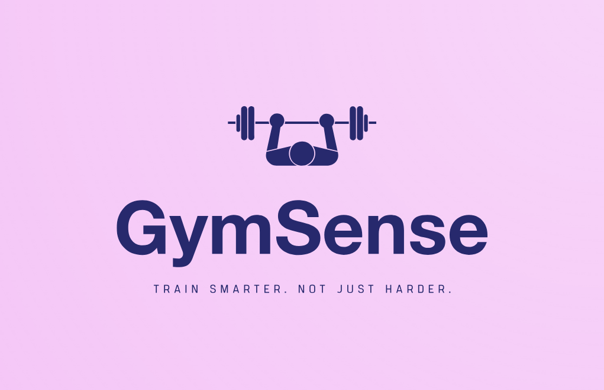

# Projektdokumentation – GymSense

<p align="center">
  
</p>

<p align="center">
  <em>Train smarter. Not just harder.</em><br/>
  Eine moderne Fitness-Webapplikation zur strukturierten Erfassung und Nachverfolgung von Krafttrainings.
</p>

<p align="center">
  <a href="https://gymsense-webapp.netlify.app/">
    
  </a>
  <a href="https://github.com/marijarad2/GymSense-Projekt">
    
  </a>
</p>

<p align="center">
  
  
  
  
  
  
</p>

---

## Inhaltsverzeichnis

1. [Ausgangslage](#1-ausgangslage)
2. [Lösungsidee](#2-lösungsidee)
3. [Vorgehen & Artefakte](#3-vorgehen--artefakte)
    1. [Understand & Define](#31-understand--define)
    2. [Sketch](#32-sketch)
    3. [Decide](#33-decide)
    4. [Prototype](#34-prototype)
    5. [Validate](#35-validate)
4. [Erweiterungen](#4-erweiterungen)
5. [Projektorganisation](#5-projektorganisation)
6. [KI-Deklaration](#6-ki-deklaration)
7. [Anhang](#7-anhang)

> **Hinweis:** Massgeblich sind die im **Unterricht** und auf **Moodle** kommunizierten Anforderungen.

---

## 1. Ausgangslage

### Problem

Die steigende Popularität von Fitness und Krafttraining führt dazu, dass immer mehr Personen regelmässig ins Fitnessstudio gehen – aber viele dokumentieren ihr Training kaum systematisch. Trainings werden spontan durchgeführt, ohne klare Struktur oder Nachverfolgung des Fortschritts. Dadurch bleibt unklar, ob tatsächlich Verbesserungen erzielt werden oder ob Anpassungen nötig wären.

Zusätzlich fällt es insbesondere Einsteiger:innen schwer, Übungen korrekt auszuführen, was das Verletzungsrisiko erhöht. Bestehende Fitness-Apps sind häufig komplex, überladen und nicht auf einfache, klare Workflows ausgerichtet.

- **Problem:** Kraftsportler:innen dokumentieren ihr Training kaum oder unsystematisch. Fortschritte bleiben unsichtbar, Übungsausführung ist oft unklar, und bestehende Apps sind zu komplex für den Alltag im Gym.
- **Ziele:**
  - Strukturierte, einfache Trainingsdokumentation ermöglichen
  - Fortschritte und persönliche Rekorde sichtbar machen
  - Übungen mit Tipps und Videos korrekt zugänglich machen
  - Intelligente Trainingsunterstützung bieten (Coach, Empfehlungen)
  - Übersichtliche, nutzerfreundliche Benutzeroberfläche bereitstellen
- **Primäre Zielgruppe:** Personen zwischen 18 und 35 Jahren, die regelmässig Krafttraining betreiben und ihren Fortschritt strukturiert digital dokumentieren möchten – von Einsteiger:innen bis hin zu Fortgeschrittenen.
- **Weitere Stakeholder:** Fitnessstudios und Kursanbieter, die über den integrierten Kursfinder (`/discover`) erreichbar sind.

---

## 2. Lösungsidee

**GymSense** ist eine moderne Fitness-Webapplikation, die Trainingsdokumentation, Fortschrittsanalyse, Kurssuche und intelligente Coaching-Funktionen in einer übersichtlichen App vereint.

- **Kernfunktionalität:**

| Workflow | Beschreibung |
|---|---|
| 🏋️ Training erfassen | Übungen, Sätze, Gewicht, Wiederholungen und Notizen eintragen |
| 📈 Fortschritt verfolgen | Gewichtsentwicklung pro Übung und persönliche Rekorde (PR) visualisieren |
| 📋 Trainingspläne | Vorgefertigte Pläne auswählen, starten und direkt ins Training übernehmen |
| 🔍 Übungsbibliothek | Suche, Filter nach Muskelgruppe, Tipps, Videos, Lieblingsübung speichern |
| 👤 Profil & Statistiken | Trainingsstreak, Wochenziel, Kalender, Health-Daten, Rekordübersicht |
| 📍 Kursfinder | Fitnesskurse in der Nähe finden, nach Typ filtern, Google Maps Routen öffnen |
| 🥗 Rezeptsystem | Fitness-Rezepte mit Kalorien, Protein, Anleitungen und Kategoriefilter |
| 🤖 GymSense Coach | Regelbasierter Fitness-Assistent mit kontextbezogenen Antworten |

- **Annahmen:**
  - Nutzer:innen sind motiviert zu dokumentieren, wenn der Aufwand minimal ist
  - Visuelle Fortschrittsdaten erhöhen die langfristige Trainingsmotivation
  - Ein integrierter Coach kann einfache Fitnessfragen ohne KI-Backend beantworten

- **Abgrenzung:**
  - Kein Social-Sharing oder Community-Funktionen
  - Keine echte Apple-Health-API-Integration (nur Prototyp-Darstellung)
  - Kein automatischer Ernährungsplan-Generator

---

## 3. Vorgehen & Artefakte

Die Durchführung erfolgt phasenbasiert; dokumentiert sind die wichtigsten Ergebnisse je Phase.

### 3.1 Understand & Define

#### Zielgruppenverständnis

Zur Problemraumanalyse wurde eine Proto-Persona erarbeitet, die typische Nutzer:innen von GymSense repräsentiert:

---

**🧑 Proto-Persona: "Fitness-Fabian"**

| Merkmal | Beschreibung |
|---|---|
| Alter | 23 Jahre, Student |
| Fitnesslevel | Leicht fortgeschritten, trainiert seit ~1 Jahr |
| Verhalten | Geht 3–4× pro Woche ins Gym, dokumentiert mit Notizen-App |
| Frustrationen | Zu komplexe Apps, keine klaren Fortschritte erkennbar, keine Struktur |
| Ziele | Gewichte steigern, Muskelaufbau, strukturierter trainieren |
| Geräte | Smartphone im Gym, Laptop zuhause |

---

#### Wesentliche Erkenntnisse

- Viele Fitness-Apps sind zu komplex – einfache Workflows entscheiden über langfristige Nutzung
- **Fortschritt ist der wichtigste Motivationsfaktor** im Krafttraining
- Mobile Nutzung (Smartphone im Gym) ist zentral → vollständige Responsiveness ist Pflicht
- Übungen mit Tipps und Videos helfen Einsteiger:innen enorm
- Ein Trainingskalender schafft Überblick und erhöht das Commitment-Gefühl
- Nutzer:innen wollen schnell ins Training – keine langen Onboarding-Flows

---

### 3.2 Sketch

Es wurden drei Varianten konzipiert und skizziert:

| Variante | Konzept | Stärke | Schwäche |
|---|---|---|---|
| **A – Minimales Logbuch** | Reines Text-Interface, keine Extras, maximal simpel | Extrem schnell, null Einstiegshürde | Kein Mehrwert, keine Motivation |
| **B – Dashboard-App** | Starke Startseite mit KPIs, Navigation zu allen Features | Übersicht + Tiefe, erweiterbar, bekanntes UX-Muster | Mehr Entwicklungsaufwand |
| **C – Step-by-Step Flow** | Geführter Trainingsablauf, kein freies Browsen | Ideal für Einsteiger | Zu einschränkend für erfahrene Nutzer |

**Skizzen:**

> 📎 *Skizzen werden separat als Bilder eingefügt (Variante A, B, C – handgezeichnet / digital)*

**Wesentliche Unterschiede:**
- Variante A verzichtet auf jegliche Statistik und Gamification
- Variante B kombiniert freie Navigation mit einem informativen Dashboard
- Variante C schränkt die User Journey auf einen einzigen linearen Pfad ein

---

### 3.3 Decide

#### Gewählte Variante & Begründung

**✅ Variante B – Dashboard-App** wurde gewählt aufgrund folgender Entscheidkriterien:

| Kriterium | Begründung |
|---|---|
| Freie Navigation | Ermöglicht flexible Trainingsabläufe je nach Tagesform |
| Profilseite | Bündelt alle persönlichen Daten und Statistiken an einem Ort |
| Erweiterbarkeit | Modulare Seitenstruktur erlaubt spätere Feature-Erweiterungen |
| Bekanntes UX-Muster | Navbar + Cards senkt die Einstiegshürde |
| Motivationsaspekte | PR-Badges, Streaks, Wochenziel passen besser zu einer Dashboard-Logik |

#### End-to-End-Ablauf (User Journey)

```
🆕 Registrierung / Login
        ↓
🏠 Startseite  (Willkommen + Smart Welcome für neue Nutzer / Konfetti-Animation)
        ↓
📋 Trainingsplan auswählen  (/plans  →  Empfehlung basierend auf Level)
        ↓
🏋️ Training erfassen  (/training  →  Plan wird automatisch geladen)
        ↓
➕ Übungen & Sätze eintragen  →  Live-Zusammenfassung (Übungen / Sätze / Volumen)
        ↓
💾 Training speichern  →  Fortschritt & Streak werden automatisch aktualisiert
        ↓
📈 Fortschritt analysieren  (/progress  →  PRs, Verlauf, Toast-Benachrichtigung)
        ↓
👤 Profil prüfen  (/profile  →  Streak, Wochenziel, Kalender, Health-Daten)
```

#### Mockup

Das Mockup wurde in **Figma** erstellt und zeigt alle zentralen Screens: Startseite, Training, Fortschritt, Übungen, Trainingspläne, Profil, Rezepte, Kursfinder.

> 📎 *Figma-Link / Screenshots werden ergänzt*

---

### 3.4 Prototype

#### 3.4.1. Entwurf (Design)

> **Hinweis:** Hier wird der **Prototyp** beschrieben, nicht das **Mockup**.

##### Informationsarchitektur

| Route | Seite | Authentifizierung | Beschreibung |
|---|---|---|---|
| `/` | Startseite | Optional | Hero-Section, Willkommensbereich (logged in/out), Projektbeschreibung |
| `/login` | Login | – | Anmeldung mit Passwort-Toggle |
| `/register` | Registrierung | – | Konto erstellen mit Live-Passwortvalidierung & Stärkeanzeige |
| `/logout` | Abmeldung | ✅ | POST-Action, redirect zur Startseite |
| `/exercises` | Übungen | Optional | Bibliothek mit Suche, Muskelgruppenfilter, Videos, Favoriten |
| `/plans` | Trainingspläne | ✅ | Vorgefertigte Pläne mit kontextbasierter Empfehlung und Startfunktion |
| `/training` | Training erfassen | ✅ | Übungen hinzufügen, Sätze eintragen, Live-Zusammenfassung |
| `/progress` | Fortschritt | ✅ | Gewichtsverlauf, persönliche Rekorde, PR-Badges, Toast |
| `/profile` | Profil | ✅ | Statistiken, Kalender, Wochenziel, Health-Prototype, Streaks |
| `/recipes` | Rezepte | Optional | Fitness-Rezepte mit Kalorien, Protein, Kategoriefilter, Modal |
| `/discover` | Kursfinder | Optional | Kurse filtern, Standort teilen, Distanzberechnung, Google Maps |
| `/help` | FAQ / Help | Optional | Häufige Fragen & Antworten, Link zum Kontaktformular |
| `/contact` | Kontakt | Optional | Coaching-Anfrage-Formular mit Animation |
| `/impressum` | Impressum | – | Rechtliche Angaben |
| `/datenschutz` | Datenschutz | – | Datenschutzerklärung |
| `/agb` | AGB | – | Allgemeine Geschäftsbedingungen |
| `/api/training-plan/[id]` | API | ✅ | Trainingsplan per ID als JSON laden |

##### User Interface Design

**Wichtige Screens mit Designentscheidungen:**

| Screen | Besonderheit |
|---|---|
| **Startseite (eingeloggt)** | Grosses Welcome-Hero mit Konfetti-Animation (6 fallende Emojis), Gradient, "Willkommen zurück"-Label |
| **Training erfassen** | Übungsauswahl via Dropdown, dynamische Satzkarten, Live-Zusammenfassung (Übungen / Sätze / Volumen in Echtzeit) |
| **Fortschritt** | Kartenraster pro Übung mit Balkendiagramm, PR-Badge 🎉, Differenzanzeige (+X kg), animierter Toast |
| **Profil** | Stats-Grid, Dashboard-Karten (Wochenziel, Health, Streak, Coach-Tipp), interaktiver Monatskalender mit Swipe |
| **Kursfinder** | Hero-Bild, Standort-Card mit Datenschutzhinweis, Typfilter, Kurskarten mit Distanz und Maps-Link |
| **Rezepte** | Kategoriefilter-Buttons, Karten-Grid mit Bildern, Modal mit Zutaten & Anleitungen |
| **Übungen** | Suchfeld + Muskelgruppen-Dropdown, Resultat-Counter, Tipps-Liste und YouTube-iframe pro Karte |

> 📸 *Screenshots der fertigen App werden separat ergänzt*

##### Designentscheidungen

| Entscheidung | Begründung |
|---|---|
| **Farbschema Lila/Pink** (`#b06eb0`, `#f7d1f8`) | Unverwechselbar, modern, konsistent auf allen Screens |
| **Vollständiger Dark Mode** | Nutzbarkeit im Gym (dunkle Umgebung), gespeichert via `localStorage` |
| **Card-System** | Einheitliche Darstellung mit `border-radius: 18–22px`, lila Schlagschatten, Hover-Lift-Effekt |
| **Hero-Sections pro Seite** | Jede Seite hat ein eigenes Hero-Bild mit Overlay, Gradient und Zoom-on-Hover |
| **Responsive Design** | Grid-Breakpoints, angepasste Schriftgrössen, Touch-Swipe für Kalender |
| **Bootstrap Icons** | Konsistentes Icon-System ohne externe Abhängigkeiten |

---

#### 3.4.2. Umsetzung (Technik)

##### Technologie-Stack

| Technologie | Version | Zweck |
|---|---|---|
| **SvelteKit** | Aktuell | Full-Stack Web Framework (Routing, SSR, Form Actions) |
| **Svelte 5** | Aktuell | UI & reaktives State Management (`$state`, `$derived`, `$effect`) |
| **Bootstrap 5** | 5.x | CSS Framework & UI-Komponenten (Navbar, Grid, Utilities) |
| **Bootstrap Icons** | Aktuell | Icon-System |
| **TypeScript** | 5.x | Server-seitige Logik & Typsicherheit |
| **MongoDB Atlas** | Cloud | Datenbank (Nutzer, Trainings, Übungen, Pläne, Kalender) |
| **Git & GitHub** | – | Versionsverwaltung |
| **Netlify** | – | Deployment & Hosting (Continuous Deployment via GitHub) |

##### Tooling

- **IDE:** Visual Studio Code
- **Extensions:** Svelte for VS Code, ESLint, Prettier, MongoDB for VS Code
- **Lokale Entwicklung:** `npm run dev` mit HMR (Hot Module Replacement)
- **KI-Einsatz:** Claude (Anthropic), GitHub Copilot → Details in Kapitel 6

##### Struktur & Komponenten

```
src/
├── lib/
│   ├── assets/              # Logo, Hero-Images (Light/Dark je Seite)
│   ├── components/
│   │   └── HeroSection.svelte   # Startseiten-Hero für nicht-eingeloggte User
│   └── server/              # MongoDB-Verbindung, Datenbankhelfer
├── routes/
│   ├── +layout.server.ts    # Globaler Session-Load
│   ├── +layout.svelte       # Navbar, Footer, Dark Mode Toggle, GymSense Coach
│   ├── +page.svelte         # Startseite (Welcome Hero / Public Hero)
│   ├── login/               # Login mit Passwort-Toggle
│   ├── register/            # Registrierung + Live-Passwortvalidierung
│   ├── logout/              # Logout POST-Action
│   ├── exercises/           # Übungsbibliothek
│   ├── plans/               # Trainingspläne mit Empfehlung
│   ├── training/            # Training erfassen
│   ├── progress/            # Fortschrittsansicht
│   ├── profile/             # Profilseite mit Kalender & Health
│   ├── recipes/             # Fitness-Rezeptsystem
│   ├── discover/            # Kursfinder mit Geolocation
│   ├── help/                # FAQ & Help
│   ├── contact/             # Kontaktformular
│   ├── impressum/           # Impressum
│   ├── datenschutz/         # Datenschutz
│   ├── agb/                 # AGB
│   └── api/
│       └── training-plan/[id]/  # REST-Endpunkt für Trainingsplan
```

**Svelte 5 Runes – Verwendung im Projekt:**

| Rune | Verwendung |
|---|---|
| `$state` | Lokaler reaktiver State: `selectedType`, `userLocation`, `isDarkMode`, `coachMessages`, `workoutExercises`, … |
| `$derived` | Einfache abgeleitete Werte: `courseTypes`, `muscleGroups`, `filteredRecipes`, `stepPercentage` |
| `$derived.by` | Komplexe Ableitungslogik: `filteredCourses` (mit Distanzsortierung), `summary` (Volumenberechnung), `activityRecommendation` |
| `$effect` | Dark-Mode-Observer via `MutationObserver`, Toast-Timer via `setTimeout`, Theme-Persistence via `localStorage` |
| `$props` | Daten und Form-Resultate aus Server Load-Funktionen (`data`, `form`) |

##### Daten & Schnittstellen

| Bereich | Beschreibung |
|---|---|
| **MongoDB Collections** | `users`, `workouts`, `exercises`, `trainingPlans`, `calendarEntries` |
| **SvelteKit Load-Funktionen** | Serverseitige Datenladen pro Route (`+page.server.ts` / `+page.server.js`) |
| **Form Actions** | POST-Handler für: Training speichern, Lieblingsübung setzen, Kalendereinträge, Wochenziel, Health-Daten, Kontaktformular |
| **API-Route** | `GET /api/training-plan/[id]` → liefert Plan-Details als JSON (für client-seitiges Laden beim Trainingsstart via `fetch`) |
| **Authentifizierung** | Session-basiert via verschlüsseltem Cookie (SvelteKit Hooks, `SESSION_SECRET`) |
| **Geolocation** | Browser-API `navigator.geolocation` für Standort im Kursfinder |

##### Deployment

- **Plattform:** Netlify (Continuous Deployment via GitHub)
- **Datenbank:** MongoDB Atlas (Free Tier, Cloud)
- **Live-URL:** [https://gymsense-webapp.netlify.app/](https://gymsense-webapp.netlify.app/)
- **Repository:** [https://github.com/marijarad2/GymSense-Projekt](https://github.com/marijarad2/GymSense-Projekt)

##### Besondere Entscheidungen

| Entscheidung | Begründung |
|---|---|
| **Dark Mode via `document.body.classList`** | SvelteKit SSR erlaubt beim ersten Render keinen DOM-Zugriff → client-seitig via `$effect` + `localStorage` |
| **Hero-Images Light/Dark** | Separate Bildversionen pro Seite für optimale Darstellung in beiden Themes |
| **Trainingsplan-Loading via `fetch`** | URL-Parameter (`?plan=ID`) werden erst client-seitig via `onMount` ausgewertet |
| **Rezepte als statisches Array** | Rezeptdaten ändern sich nicht → kein DB-Aufruf nötig, schnellere Ladezeiten |
| **Coach vollständig im Frontend** | Regelbasierte Logik ohne externes KI-API → keine Latenz, keine Kosten, volle Kontrolle |
| **Haversine-Formel für Distanz** | Präzise Berechnung der Luftliniendistanz zwischen Nutzerstandort und Kursanbieter |

---

### 3.5 Validate

**URL der getesteten Version:** [https://gymsense-webapp.netlify.app/](https://gymsense-webapp.netlify.app/)

#### Ziele der Prüfung

- Sind die zentralen Workflows intuitiv bedienbar (Training erfassen, Fortschritt ansehen)?
- Versteht die Testperson den GymSense Coach und die Profilfunktionen?
- Sind Fehlermeldungen und Feedback verständlich?
- Funktioniert der Dark Mode konsistent auf allen Seiten?
- Wie verhält sich die App auf Mobilgeräten?

#### Vorgehen

Moderierter Usability-Test on-site. Die Testperson erhält schriftliche Aufgaben und führt diese selbstständig durch. Beobachtungen werden laufend protokolliert. Nach dem Test werden Verbesserungsvorschläge gesammelt.

#### Stichprobe

| Merkmal | Beschreibung |
|---|---|
| ID | TP-01 |
| Alter | 22 Jahre |
| Rolle | Student, gelegentlicher Gym-Nutzer |
| Fitnesslevel | Leicht fortgeschritten |
| Gerät | Laptop (Chrome) |
| Testregistrierung | `test.user@gymsense.ch` / `GymSense2026!` |

#### Aufgaben / Szenarien

| Nr. | Aufgabe | Ziel |
|---|---|---|
| A1 | Registriere dich als neue Nutzerin / neuer Nutzer. | Registrierung erfolgreich |
| A2 | Verwende ein schwaches Passwort bei der Registrierung. | Fehlermeldung erscheint |
| A3 | Melde dich mit deinen Zugangsdaten an. | Login funktioniert |
| A4 | Logge dich über das Menü wieder aus. | Logout funktioniert |
| A5 | Filtere Übungen nach Muskelgruppe oder Suchbegriff. | Filter zeigt korrekte Übungen |
| A6 | Speichere eine Übung als Lieblingsübung. | Favorit erscheint im Profil |
| A7 | Wähle einen Trainingsplan aus und starte ihn. | Plan wird korrekt geladen |
| A8 | Erfasse ein Training und speichere es. | Training wird gespeichert |
| A9 | Öffne die Fortschrittsseite. | Fortschritt und Diagramme sichtbar |
| A10 | Erreiche einen neuen persönlichen Rekord. | PR-Badge wird angezeigt |
| A11 | Ändere dein Wochenziel im Profil. | Neues Ziel wird gespeichert |
| A12 | Verwende den Trainingskalender. | Tage werden korrekt markiert |
| A13 | Aktualisiere deine Schrittdaten. | Schritte werden gespeichert |
| A14 | Stelle dem GymSense Coach eine Fitnessfrage. | Coach antwortet korrekt |
| A15 | Öffne die Rezeptseite. | Rezepte werden korrekt geladen |
| A16 | Öffne die Details eines Rezepts. | Anleitung und Infos sichtbar |
| A17 | Filtere Rezepte nach Kategorie. | Kategoriefilter funktioniert |
| A18 | Suche einen Fitnesskurs im Kursfinder. | Kurse werden angezeigt |
| A19 | Teile deinen Standort im Kursfinder. | Standort wird verwendet |
| A20 | Öffne eine Route via Google Maps. | Maps-Integration funktioniert |
| A21 | Aktiviere den Dark Mode. | UI bleibt vollständig lesbar |

#### Kennzahlen & Beobachtungen

| Test ID | Aktivität | Erwartetes Resultat | Erfüllt | Bemerkung |
|---|---|---|---|---|
| T-01 | Registrierung | User erfolgreich registriert | ✅ | Ohne Probleme, Konfetti-Animation positiv aufgenommen |
| T-02 | Passwortvalidierung | Fehlermeldung bei schwachem Passwort | ✅ | Live-Validierung reagierte sofort und korrekt |
| T-03 | Login | Login funktioniert | ✅ | Anmeldung inkl. Passwort-Toggle problemlos |
| T-04 | Logout | User wird ausgeloggt | ✅ | Dropdown-Menü intuitiv bedienbar |
| T-05 | Übungen filtern | Passende Übungen angezeigt | ✅ | Filter korrekt, Resultat-Counter hilfreich |
| T-06 | Lieblingsübung speichern | Favorit erscheint im Profil | ✅ | Sofortiges Feedback positiv bewertet |
| T-07 | Trainingsplan starten | Training korrekt geladen | ✅ | Empfehlungs-Badge wurde bemerkt und positiv erwähnt |
| T-08 | Training speichern | Training gespeichert | ✅ | Live-Zusammenfassung als besonders motivierend empfunden |
| T-09 | Fortschritt anzeigen | Diagramme visualisiert | ✅ | Balkendiagramme sofort verstanden |
| T-10 | PR erkennen | PR-Badge erscheint | ✅ | 🎉-Badge und Toast-Nachricht sehr positiv aufgenommen |
| T-11 | Wochenziel ändern | Neues Ziel gespeichert | ✅ | Intuitiv, kein Erklärungsbedarf |
| T-12 | Kalender verwenden | Tage korrekt markiert | ✅ | Swipe-Navigation auf Mobile besonders erwähnt |
| T-13 | Schritttracking | Schritte gespeichert | ✅ | Prototyp-Charakter korrekt verstanden |
| T-14 | GymSense Coach | Coach antwortet korrekt | ✅ | Vorschlagsfragen senkten Einstiegshürde deutlich |
| T-15 | Rezepte anzeigen | Rezepte korrekt geladen | ✅ | Visuelle Darstellung sehr positiv |
| T-16 | Rezeptdetails | Anleitung sichtbar | ✅ | Modal öffnete korrekt und schnell |
| T-17 | Rezeptfilter | Kategorien funktionieren | ✅ | Filter reagierte sofort |
| T-18 | Kursfinder | Kurse angezeigt | ✅ | Karte und Filter klar |
| T-19 | Standort teilen | Standort verwendet | ✅ | Datenschutzhinweis positiv bemerkt |
| T-20 | Maps Integration | Google Maps öffnet korrekt | ✅ | Route in neuem Tab geöffnet |
| T-21 | Dark Mode | UI bleibt lesbar | ✅ | Konsistenz auf allen Seiten bestätigt |

**Erfolgsquote: 21/21 Aufgaben erfolgreich (100%)**

#### Zusammenfassung der Resultate

GymSense wurde von der Testperson durchgehend als übersichtlich und intuitiv bedienbar bewertet. Alle 21 definierten Testfälle konnten ohne Anleitung erfolgreich durchgeführt werden. Besonders positiv hervorgehoben wurden die **Live-Trainings-Zusammenfassung**, der **PR-Badge mit Toast-Notification**, die **Swipe-Navigation im Kalender** sowie der **vollständige Dark Mode**. Der GymSense Coach wurde als hilfreiche Ergänzung wahrgenommen – die Vorschlagsfragen erleichterten den Einstieg spürbar. Die Testperson erwähnte, dass die App modern wirkt und grundsätzlich auch privat im Gym eingesetzt werden würde.

#### Abgeleitete Verbesserungen

| Priorität | Verbesserung | Begründung | Umgesetzt |
|---|---|---|---|
| 🔴 Hoch | Sätze im Training wieder entfernen können | Testperson benötigte diese Funktion direkt | ✅ Ja |
| 🟡 Mittel | Kontaktformular in Navigation integrieren | Bessere Erreichbarkeit des Supports | ✅ Ja |
| 🟡 Mittel | FAQ-Seite im Help-Bereich ausbauen | Häufige Fragen vorab beantworten | ✅ Ja |
| 🟢 Niedrig | Impressum, Datenschutz und AGB ergänzen | Rechtliche Vollständigkeit | ✅ Ja |

---

## 4. Erweiterungen

### 4.1 Dark Mode (vollständig)

- **Beschreibung & Nutzen:** Vollständiger Dark Mode mit eigenem Farbsystem für alle Seiten und Komponenten. Zustand wird in `localStorage` gespeichert und beim nächsten Besuch wiederhergestellt. Verbessert die Nutzbarkeit in dunklen Umgebungen (z.B. Gym) erheblich.
- **Wo umgesetzt:** `+layout.svelte` (Toggle, `localStorage`, Body-Class `dark-mode`); alle Seiten via `:global(body.dark-mode)` CSS-Selektoren; Hero-Images mit separaten Light/Dark-Versionen pro Seite.
- **Referenz:** `+layout.svelte`, alle Seiten-Komponenten (Styles-Abschnitt)
- **Aus Evaluation abgeleitet?** Nein – von Beginn an geplant, in Evaluation auf allen 21 Screens bestätigt (T-21)

---

### 4.2 GymSense Coach (regelbasierter Fitness-Assistent)

- **Beschreibung & Nutzen:** Chat-Assistent mit ca. 10 regelbasierten Antwortpfaden, der kontextbezogene Fitness-Tipps gibt. Nutzt Echtzeit-Nutzerdaten (Schritte, Streak, Wochenziel, Lieblingsübung) aus dem Server-Load. Vorschlagsfragen erleichtern den Einstieg. Vollständig ohne externes KI-API – kein Backend-Aufruf, keine Latenz.
- **Wo umgesetzt:** `+layout.svelte` – `answerCoach()`-Funktion, Chat-UI als Fixed-Widget mit Toggle-Button, `coachMessages`-State, `suggestedQuestions`-Derived.
- **Referenz:** `+layout.svelte`, Kap. 3.4.1 (Informationsarchitektur)
- **Aus Evaluation abgeleitet?** Nein – von Beginn an geplant, in Evaluation sehr positiv bewertet (T-14)

---

### 4.3 Live Trainings-Zusammenfassung

- **Beschreibung & Nutzen:** Während der Trainingserfassung werden Anzahl Übungen, Sätze und das gesamte Trainingsvolumen (in kg) in Echtzeit berechnet und als Zusammenfassungskarte angezeigt. Motiviert Nutzer:innen und gibt sofortigen Überblick ohne manuelle Berechnung.
- **Wo umgesetzt:** `training/+page.svelte` – `$derived.by()` Summary-Objekt (`exerciseCount`, `setCount`, `totalVolume`), `summary-card`-Sektion im Template, reaktive Aktualisierung via `workoutExercises`-State.
- **Referenz:** Kap. 3.4.2 (Wichtige Funktionen), Kap. 3.5 (T-08)
- **Aus Evaluation abgeleitet?** Nein – in Evaluation als besonders motivierend bewertet

---

### 4.4 Persönliche Rekorde (PR-Erkennung & Toast)

- **Beschreibung & Nutzen:** Nach jedem Training werden automatisch persönliche Rekorde erkannt und auf der Fortschrittsseite mit einem "PR 🎉"-Badge hervorgehoben. Zusätzlich erscheint eine animierte Toast-Benachrichtigung ("Du hast Fortschritte gemacht 🚀") mit Slide-in-Animation, wenn Gewichtssteigerungen erkannt werden. Erhöht die Trainingsmotivation signifikant.
- **Wo umgesetzt:** `progress/+page.svelte` – `isPersonalBest`-Flag aus Server-Daten, `showToast`-State, `$effect` mit `setTimeout` (3 Sekunden), `@keyframes slideIn` CSS-Animation.
- **Referenz:** Kap. 3.4.1, Kap. 3.5 (T-09, T-10)
- **Aus Evaluation abgeleitet?** Nein – als besonders positiv hervorgehoben in Evaluation

---

### 4.5 Interaktiver Trainingskalender mit Swipe

- **Beschreibung & Nutzen:** Vollständiger Monatskalender auf der Profilseite mit Monat- und Jahresnavigation, Touch-Swipe-Unterstützung für Mobile, drei Eintragstypen (🏋️ Training, 💤 Rest Day, 🎟️ Kurs) und direkten Aktions-Buttons pro Kalendertag.
- **Wo umgesetzt:** `profile/+page.svelte` – `getCalendarDays()`, `handleTouchStart/End()` (Swipe-Logik), `formatDateForDb()`, Form-Actions `?/addTraining`, `?/addRest`, `?/addCourse` im Server.
- **Referenz:** Kap. 3.4.1 (Profil-Screen)
- **Aus Evaluation abgeleitet?** Nein – Swipe-Funktion in Evaluation explizit positiv bewertet (T-12)

---

### 4.6 Passwort-Stärke-Anzeige (Live-Validierung)

- **Beschreibung & Nutzen:** Bei der Registrierung wird die Passwortstärke in Echtzeit analysiert und als farbiger Fortschrittsbalken (schwach / mittel / stark) angezeigt. Vier Regeln (Länge ≥8, Zahl, Sonderzeichen, Grossbuchstabe) werden live validiert und grün markiert, sobald sie erfüllt sind. Shake-Animation bei nicht übereinstimmenden Passwörtern gibt klares Feedback.
- **Wo umgesetzt:** `register/+page.svelte` – `$derived`-Regelobjekte, `strength`-State, `strengthClass`-Klassen, `@keyframes shake`.
- **Referenz:** Kap. 3.4.1, Kap. 3.5 (T-01, T-02)
- **Aus Evaluation abgeleitet?** Nein – in Evaluation als positives Detail erwähnt

---

### 4.7 Apple Health Prototype (Schritttracking)

- **Beschreibung & Nutzen:** Simulation eines Apple-Health-Integrationsprototypen auf der Profilseite. Nutzer:innen können Schritte heute, Tagesziel und Wochenziel eingeben. Aktivitätslevel (Niedrig/Mittel/Hoch) und eine Trainingsempfehlung werden automatisch berechnet. Der GymSense Coach verwendet diese Werte für kontextbezogene Antworten.
- **Wo umgesetzt:** `profile/+page.svelte` – `stepPercentage`, `activityLevel`, `activityRecommendation` als `$derived`, Form-Actions `?/updateHealth` und `?/connectHealth` im Server.
- **Referenz:** Kap. 3.4.1 (Profil-Screen), Kap. 3.5 (T-13)
- **Aus Evaluation abgeleitet?** Nein – Prototyp-Charakter in Evaluation korrekt verstanden

---

### 4.8 Rezeptsystem mit Kategoriefilter & Modal

- **Beschreibung & Nutzen:** Vollständiges Fitness-Rezeptsystem mit 15+ Rezepten, Kategoriefiltern (Morgenessen, Mittagessen, Abendessen, Snack), Kalorienangaben, Proteinwerten, Zubereitungszeiten und detaillierter Zutaten-/Anleitungsansicht via Modal. Nicht eingeloggte User sehen nur 4 Rezepte als Teaser. Fördert gesunde Ernährung als Ergänzung zum Training.
- **Wo umgesetzt:** `recipes/+page.svelte` – statisches Rezept-Array (15 Einträge), `selectedCategory`-Filter, Modal-State `selectedRecipe`, `filteredRecipes` als `$derived.by()` mit Login-Check (`data.user ? allRecipes : allRecipes.slice(0, 4)`).
- **Referenz:** Kap. 3.4.1, Kap. 3.5 (T-15–T-17)
- **Aus Evaluation abgeleitet?** Nein – in Evaluation durchgehend positiv bewertet

---

### 4.9 Kursfinder mit Geolocation & Google Maps

- **Beschreibung & Nutzen:** Kurssuche mit Fitnesskurs-Daten aus MongoDB, Typfilter (Yoga, Pilates, HIIT, …), Standortabfrage via Browser-Geolocation API, Distanzberechnung via Haversine-Formel und automatischer Sortierung nach Entfernung. Direkte Google Maps Routenöffnung (zu Fuss, mit/ohne Standort). Datenschutzhinweis integriert.
- **Wo umgesetzt:** `discover/+page.svelte` – `getDistanceKm()` (Haversine), `getLocation()` via `navigator.geolocation`, `getDirectionsUrl()` für Maps-Link, `filteredCourses` mit Distanz-Sortierung als `$derived.by()`.
- **Referenz:** Kap. 3.4.1, Kap. 3.5 (T-18–T-20)
- **Aus Evaluation abgeleitet?** Nein – vollständig geplant und in Evaluation positiv bewertet

---

### 4.10 Smart Welcome Experience (Onboarding-Animation)

- **Beschreibung & Nutzen:** Neue Nutzer:innen erhalten nach der Registrierung eine besondere Willkommensseite mit Konfetti-Animation (6 fallende Emojis), personalisierter Begrüssung und animiertem Hero-Bereich via URL-Parameter `?registered=true`. Bestehende Nutzer:innen sehen "Schön, dass du zurück bist 💪". Verbessert das Onboarding-Erlebnis spürbar.
- **Wo umgesetzt:** `+page.svelte` – `isNewUser` via `page.url.searchParams.get('registered')`, `@keyframes confettiFall` und `welcomePop`, Conditional-Rendering im Template.
- **Referenz:** Kap. 3.4.1 (Startseite)
- **Aus Evaluation abgeleitet?** Nein – in Evaluation sehr positiv aufgenommen (T-01)

---

### 4.11 Kontextbasierte Plan-Empfehlung

- **Beschreibung & Nutzen:** Auf der Trainingspläne-Seite wird basierend auf dem Nutzerprofil ein Plan mit "Empfohlen"-Badge und farbigem Rahmen hervorgehoben. Eine Empfehlungskarte erklärt die Wahl und motiviert zum direkten Start.
- **Wo umgesetzt:** `plans/+page.svelte` – `data.recommendation` aus Server-Load, `class:recommended`-Binding, `recommendation-card`-Sektion.
- **Referenz:** Kap. 3.4.1 (Trainingspläne-Screen), Kap. 3.5 (T-07)
- **Aus Evaluation abgeleitet?** Nein – Empfehlungs-Badge in Evaluation bemerkt und positiv erwähnt

---

### 4.12 Animationen & Mikrointeraktionen

- **Beschreibung & Nutzen:** Die App enthält Konfetti beim Onboarding, Hover-Lift-Effekte auf Cards (`translateY(-4px)`), Slide-in-Toast bei PR-Erkennung, Shake-Animation bei Formularfehlern und sanfte Button-Transitions. Dadurch wirkt GymSense moderner, interaktiver und motivierender.
- **Wo umgesetzt:** Verteilt über `+page.svelte`, `register/+page.svelte`, `progress/+page.svelte`, `profile/+page.svelte` und globale CSS via `+layout.svelte`.
- **Referenz:** Kap. 3.4.1 (User Interface Design)
- **Aus Evaluation abgeleitet?** Nein – durchgehend positiv wahrgenommen in der Evaluation

---

### 4.13 FAQ- & Help-System

- **Beschreibung & Nutzen:** Dedizierte FAQ-Seite (`/help`) mit 7 häufigen Fragen und Antworten als interaktives Accordion, sowie Link zum Kontaktformular. Direkt über das User-Dropdown erreichbar. Verbessert Nutzerunterstützung und senkt Support-Anfragen.
- **Wo umgesetzt:** `help/+page.svelte` – `faqs`-Array, `openIndex`-State, `toggleFaq()`-Funktion, Kontakt-CTA-Box.
- **Referenz:** Kap. 3.4.1 (Informationsarchitektur)
- **Aus Evaluation abgeleitet?** Ja – als direkte Massnahme aus der Evaluation umgesetzt

---

### 4.14 Coaching-Kontaktformular

- **Beschreibung & Nutzen:** Modernes Kontaktformular (`/contact`) für Coaching-Anfragen mit Feldern für Fitnessziele, Trainingslevel und Unterstützungsbereich. Animierte "Nachricht wird gesendet"-Interaktion gibt klares Feedback.
- **Wo umgesetzt:** `contact/+page.svelte` – Formular mit SvelteKit Form Action, Lade-Animation via State.
- **Referenz:** Kap. 3.4.1 (Informationsarchitektur)
- **Aus Evaluation abgeleitet?** Ja – Testperson wünschte bessere Erreichbarkeit des Supports

---

### 4.15 Rechtliche Seiten & Footer

- **Beschreibung & Nutzen:** Impressum, Datenschutzerklärung und AGB als vollständige Seiten. Rechtliche Links horizontal im Footer ergänzt. Verbessert Professionalität und rechtliche Vollständigkeit der Plattform.
- **Wo umgesetzt:** `impressum/`, `datenschutz/`, `agb/` als eigene Routen; `+layout.svelte` Footer mit `.legal-links`-Sektion.
- **Referenz:** Kap. 3.4.1 (Informationsarchitektur), Footer in `+layout.svelte`
- **Aus Evaluation abgeleitet?** Ja – als direkte Massnahme aus der Evaluation ergänzt

---

## 5. Projektorganisation

- **Repository & Struktur:** [https://github.com/marijarad2/GymSense-Projekt](https://github.com/marijarad2/GymSense-Projekt)

  Die Struktur folgt SvelteKit-Konventionen. Sämtlicher Source-Code, Assets und diese Dokumentation sind im Repository enthalten.

- **Commit-Praxis:** Commits wurden mit sprechenden Nachrichten versehen, die den jeweiligen Fortschritt klar dokumentieren. Beispiele:
  - `feat: add training calendar with swipe support`
  - `feat: implement GymSense Coach with context-aware responses`
  - `fix: dark mode hero image switch on MutationObserver`
  - `feat: add recipe category filter and modal detail view`
  - `docs: complete README with all extensions and evaluation`

- **Issue-Management:** Aufgaben, Feature-Requests und Bugs wurden im GitHub Issue Tracker erfasst, priorisiert und abgearbeitet. Verbesserungen aus der Evaluation (FAQ, Kontaktformular, rechtliche Seiten) wurden als Issues angelegt und nach der Evaluation umgesetzt.

---

## 6. KI-Deklaration

### 6.1 KI-Tools

- **Eingesetzte Tools:**

| Tool | Version / Variante | Zweck |
|---|---|---|
| **Claude (Anthropic)** | Claude Sonnet 4.5 / claude.ai | Dokumentation, Code-Review, CSS-Entwicklung, Architekturideen, Debugging |
| **GitHub Copilot** | – | Inline-Code-Vorschläge im Editor, Autovervollständigung |

- **Zweck & Umfang:**
  - **Dokumentation:** Strukturierung und Ausformulierung der README-Abschnitte (Ausgangslage, Lösungsidee, Erweiterungen, KI-Deklaration)
  - **Code-Unterstützung:** Dark-Mode CSS-Styles (konsistentes Farbsystem über ~12 Seiten), Svelte 5 `$derived.by()`-Patterns, Responsiveness-Anpassungen, Animationen
  - **Debugging:** Hilfe bei SvelteKit-spezifischen Problemen (SSR vs. Client, `$effect` vs. `onMount`, Form-Action-Patterns)
  - **Architektur:** Beratung zur Routenstruktur und Komponenten-Aufteilung

  Teile, die ganz oder teilweise KI-unterstützt entstanden: CSS-Styles (Dark Mode, Animationen), einzelne Svelte-5-Patterns (`$effect` mit `MutationObserver`), Dokumentationsstruktur und -ausformulierung.

- **Eigene Leistung (Abgrenzung):**
  - **Eigenständig erarbeitet:** Projektidee, UI-Konzept, Farbschema und Designsprache, Datenbankmodellierung, Gesamtarchitektur und Feature-Planung, Integration aller Komponenten, Testdurchführung und -auswertung, alle inhaltlichen Entscheidungen
  - **Überarbeitet/angepasst:** Alle KI-Vorschläge wurden stets auf eigene Anforderungen angepasst, im Browser getestet und bei Bedarf manuell korrigiert. Keine ungeprüfte Übernahme.

---

### 6.2 Prompt-Vorgehen

Der KI-Einsatz erfolgte iterativ und aufgabenbezogen. Typisches Vorgehen:

1. **Kontext geben:** Bestehenden Code oder Anforderung als Ausgangspunkt mitliefern (z.B. bestehende Svelte-Komponente + Farbschema)
2. **Konkrete Aufgabe formulieren:** Z.B. *"Erstelle den Dark-Mode-CSS für diese Komponente, konsistent mit dem Farbschema `#b06eb0` / `#2c2432`"*
3. **Ergebnis prüfen:** Vorschlag im Browser testen, visuell und funktional prüfen
4. **Iterieren:** Bei Fehler oder ungewünschtem Resultat den Fehler beschreiben und Korrektur anfordern

Für die Dokumentation wurde zuerst eine eigene Gliederung mit Stichpunkten erstellt, dann die KI gebeten, diese in vollständige Abschnitte auszuformulieren. Ergebnis wurde anschliessend geprüft, angepasst und ergänzt.

---

### 6.3 Reflexion

**Nutzen:** KI hat besonders bei repetitiven Aufgaben enorm Zeit gespart – insbesondere beim konsistenten Dark-Mode-CSS über ~12 verschiedene Seiten sowie bei SvelteKit-spezifischen Patterns. Auch beim Debugging (z.B. `$effect` vs. `onMount`, SSR-Einschränkungen) war die Unterstützung wertvoll.

**Grenzen:** KI-Vorschläge für Svelte 5 waren teils noch auf Svelte 4 Syntax ausgerichtet (`on:click` statt `onclick`) und mussten korrigiert werden. Architektur-, Konzept- und Designentscheidungen konnten nicht delegiert werden – hier war eigenes Urteilsvermögen entscheidend.

**Risiken & Qualitätssicherung:** Alle KI-generierten Code-Abschnitte wurden manuell getestet. Bei kritischen Funktionen (Authentifizierung, Datenbankzugriff, Session-Handling) wurde kein KI-Code ungeprüft übernommen. Bilder und Icons stammen aus eigenen Assets oder lizenzierten Quellen (Unsplash, Bootstrap Icons).

---

## 7. Anhang

### Quellen & Abhängigkeiten

| Ressource | Typ | Lizenz |
|---|---|---|
| Bootstrap 5 | CSS Framework | MIT |
| Bootstrap Icons | Icon-Font | MIT |
| SvelteKit | Web Framework | MIT |
| MongoDB Atlas | Cloud-Datenbank | Kommerziell (Free Tier) |
| Netlify | Hosting | Kommerziell (Free Tier) |
| Unsplash | Rezeptfotos | Unsplash License (kostenlos, keine Attribution erforderlich) |

### Deployment & lokale Entwicklung

**Live-App:** [https://gymsense-webapp.netlify.app/](https://gymsense-webapp.netlify.app/)

**Repository:** [https://github.com/marijarad2/GymSense-Projekt](https://github.com/marijarad2/GymSense-Projekt)

```bash
# Dependencies installieren
npm install

# Entwicklungsserver starten (mit HMR)
npm run dev

# Produktions-Build erstellen
npm run build

# Umgebungsvariablen (.env)
MONGODB_URI=mongodb+srv://...
SESSION_SECRET=...
```

### Testskript & Materialien

Testaufgaben und Szenarien: Kapitel 3.5 (A1–A21)

Testprotokoll und Beobachtungen: Kapitel 3.5 (T-01–T-21)

---

<p align="center">
  <strong>GymSense © 2026 – Train smarter. Not just harder. 💪</strong>
</p>